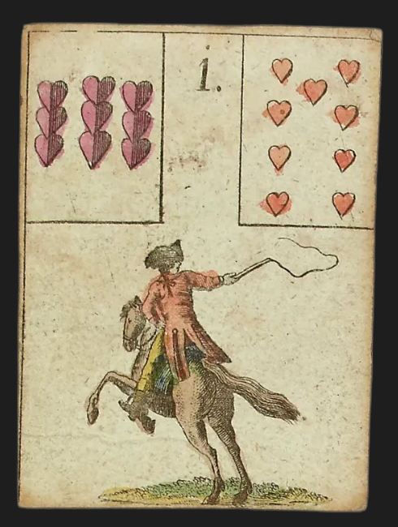

<h1>Lenormand JSON</h1>

A JSON dataset for the 36 Lenormand cards, including public-domain card images.

<center>

[English](README.md) | [简体中文](README.zh.md)

[](https://github.com/KevinGuo1007/lenormand-json/releases)
[](LICENSE)
</center>

## The cards

- `lenormand.json`: basic card data
- `lenormand-images.json`: basic card data with image paths
- `cards/`: 36 card images

## Quick Start

```js
const data = require("./lenormand-images.json");

console.log(data.cards[0]);
```

Example output:

```json
{
  "name": "Rider",
  "number": "1",
  "playing_card": "9 of Hearts",
  "suit": "Hearts",
  "img": "cards/01-Rider.png"
}
```

## Source

The card images are from Wikimedia Commons:
[*Das Spiel der Hofnung (The Game of Hope)*](https://commons.wikimedia.org/wiki/File:Das_Spiel_der_Hofnung_(The_Game_of_Hope).png).

The original work was created by Johann Kaspar Hechtel in 1799. Wikimedia Commons marks the image as public domain.

## License

The JSON data and documentation in this repository are available under the [MIT License](LICENSE).

The original card artwork is public domain.
